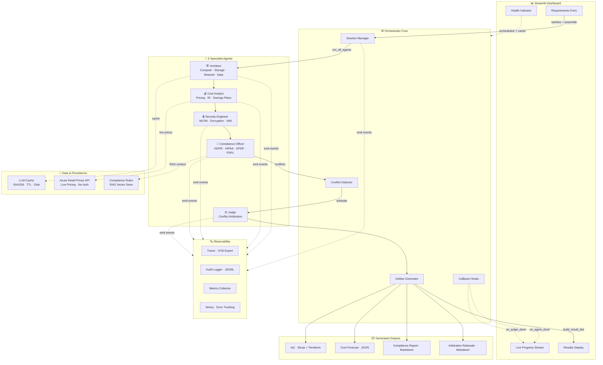

# CloudOptima 🏗️

> **Five AI specialists analyze, debate, and deliver production-grade cloud architectures — in under a minute.**

[]()
[]()
[]()

---

## Overview

**CloudOptima** is a multi-agent AI system that simulates a panel of cloud experts to optimize your Azure infrastructure. Describe your needs in plain English, and five specialized AI agents will analyze, debate, and deliver a complete cloud architecture with cost estimates, security audits, and compliance reviews.

1. **Architect** — Design compute, storage, networking, and data tiers
2. **Cost Analyst** — Estimate pricing and find savings opportunities (live Azure prices)
3. **Security Engineer** — Identify vulnerabilities and risks
4. **Compliance Officer** — Check regulatory requirements (GDPR, HIPAA, DPDP, PDPL)
5. **Judge** — Resolve conflicts between specialists and deliver a final verdict

### Outputs

| Artifact | Format | Description |
|---|---|---|
| IaC Template | Bicep & Terraform | Production-ready infrastructure templates |
| Cost Forecast | JSON | Monthly cost breakdown with optimization tips |
| Compliance Report | Markdown | Regulatory findings per framework |
| Arbitration Rationale | Markdown | Conflict resolution traceability log |
| All agent outputs | JSON | Raw specialist analysis for review |

---

## Quick Start

```bash
# 1. Clone and enter the project
cd cloudoptima

# 2. Create virtual environment
python -m venv .venv
source .venv/bin/activate  # Linux/Mac
# or: .venv\Scripts\activate  # Windows

# 3. Install dependencies
pip install -r requirements.txt

# 4. Configure (optional — demo mode works without API keys)
cp .env.example .env
# Edit .env if you have an NVIDIA API key

# 5. Launch the dashboard
streamlit run dashboard.py
```

Open **http://localhost:8501** in your browser.

### Demo Mode (No API Key Needed)

By default, the system runs in **demo mode** with realistic mock responses:
- `DEMO_MODE=true` in `.env`
- No API key required
- Fast responses (< 2s per agent)
- Full feature set including conflict detection and arbitration

### Live Mode (NVIDIA API Key)

1. Get a free API key from [NVIDIA AI Foundation Models](https://build.nvidia.com/explore/discover)
2. Set `NVIDIA_API_KEY=your_key_here` in `.env`
3. Set `DEMO_MODE=false`
4. Restart the dashboard

---

## Architecture



### Key Design Decisions

- **Registry pattern**: Adding a new agent = 1 schema + 1 prompt + 1 registry entry (~15 LOC)
- **Pydantic structured outputs**: Every LLM response validated against a typed schema
- **Graceful degradation**: All external dependencies (NVIDIA API, Sentry, disk I/O) wrapped in try/except
- **Disk-persisted cache**: SHA256-hashed LLM responses survive restarts
- **Sentry breadcrumb integration**: Every trace event and audit decision creates context for error investigation
- **Live Azure pricing**: Public Azure Retail Prices API — no authentication needed, real-time VM/storage costs

---

## Agent System Prompts

Each agent has a curated system prompt with structured JSON output requirements:

| Agent | Prompt Context |
|---|---|
| Architect | Azure Well-Architected Framework, service-specific recommendations |
| Cost Analyst | Azure pricing, reserved instances, FinOps patterns |
| Security Engineer | MCRA framework, security controls, encryption standards |
| Compliance Officer | 4 curated frameworks (DPDP, GDPR, HIPAA, PDPL) + RAG retrieval |
| Judge | Traceable, explainable, balanced, binary conflict resolution |

---

## Configuration

| Variable | Default | Description |
|---|---|---|
| `NVIDIA_API_KEY` | — | NVIDIA NIMs API key (get from build.nvidia.com) |
| `NVIDIA_BASE_URL` | `https://integrate.api.nvidia.com/v1` | API endpoint |
| `NVIDIA_MODEL` | `meta/llama-3.1-70b-instruct` | LLM model |
| `DEMO_MODE` | `true` | Use mock responses (no API key needed) |
| `SENTRY_DSN` | — | Sentry error tracking DSN (optional) |
| `LOG_LEVEL` | `INFO` | Logging verbosity |

---

## Development

```bash
# Run tests
pytest tests/ -v

# Run specific test suite
pytest tests/test_llm_cache.py -v

# Type check
mypy src/core/

# Check test coverage
pytest tests/ --cov=src/core/ --cov-report=term-missing
```

See [CONTRIBUTING.md](CONTRIBUTING.md) for detailed development guidelines.

---

## Test Suite (205+ tests)

| Module | Tests | Coverage |
|---|---|---|
| Agent Schemas | 25 | All 5 agents, JSON extraction, fallbacks, edge cases |
| LLM Cache | **45** | +12 raw key-value (get_raw/set_raw) tests |
| Sentry | 15 | Init, capture, context, breadcrumbs, before_send |
| Orchestrator | 8 | Session lifecycle, conflict detection, artifact generation |
| Observability | **32** | Tracer, audit logger, metrics, Sentry breadcrumb integration |
| Dashboard Helpers | **20** | Prompt assembly, summary extraction, sanitization |
| Health | **18** | Registry, register/check/report, uptime, version |
| Compliance | — | RAG compliance rules |
| Models | — | Pydantic model validation |
| Pricing | — | Azure pricing data, live API client |

---

## Why Multi-Agent?

- **Specialization**: Each agent masters one domain instead of averaging across all
- **Conflict resolution**: Discover hidden disagreements between cost/safety/compliance
- **Traceability**: Every decision logged with rationale — no black box
- **Extensibility**: Add agents without changing core logic

## Engineering Decisions & Challenges Solved

| Challenge | Decision | Why |
|---|---|---|
| Import failures only surfaced at request time (deps imported inside methods) | Hard dependencies (`openai`, `httpx`, `tenacity`) hoisted to module level in `llm_client.py`; optional SDKs (`anthropic`, `google-generativeai`) guarded with `try/except ImportError` | A broken environment should fail at startup with a clear message, not as a runtime 500 on the 10th user action |
| Retry decorator rebuilt on every LLM call | Shared `retry_on_transient` policy defined once at module scope | Consistent exponential backoff across all providers, zero per-call overhead |
| Azure Retail API latency / rate limits | All pricing calls cached via the shared `LLMCache` with graceful fallback to static pricing data on network failure | Cost advisor stays useful even when Azure's public API is slow or unreachable |
| Compliance rules for regions not covered by the built-in KB | Rule lookup falls back to RAG retrieval over the compliance corpus, then returns empty rather than guessing | Regulatory claims must be traceable — the system never invents a rule it can't cite |
| Observability noise in demo mode | Sentry init skipped without a DSN; breadcrumbs emitted best-effort behind try/except | Demo/local runs stay clean; production gets full tracing with PII filtering |

---

---

## Deployment

### Streamlit Community Cloud (Recommended — Free)

Deploy CloudOptima for free on [Streamlit Community Cloud](https://streamlit.io/cloud) in minutes:

```mermaid
flowchart LR
    A[Push to GitHub] --> B[Sign in at share.streamlit.io]
    B --> C[Click "New app"]
    C --> D[Select CloudOptima repo]
    D --> E[Set main file: dashboard.py]
    E --> F[Click "Deploy"]
    F --> G[cloudoptima.streamlit.app]
```

**Step-by-step:**

1. **Push to GitHub** — The repo is already at `github.com/G-Narendra/CloudOptima`
2. **Sign in** — Go to [share.streamlit.io](https://share.streamlit.io) and sign in with your GitHub account
3. **New app** — Click "New app" → "From existing repo"
4. **Select repo** — Choose `G-Narendra/CloudOptima`
5. **Configure:**
   - **Branch:** `main`
   - **Main file:** `dashboard.py`
6. **Deploy** — Click "Deploy!" and wait ~2 minutes

**Configure secrets (optional):**

Once deployed, go to your app's settings → **Secrets** and add:

```toml
# Demo mode works out of the box — no secrets needed!
# For live NVIDIA API:
NVIDIA_API_KEY = "nvapi-your-key-here"
DEMO_MODE = "false"

# Optional: Error tracking
SENTRY_DSN = "https://your-dsn@sentry.io/123"
```

Your app will be live at **`https://cloudoptima.streamlit.app`** 🎉

---

## Project Structure

```
cloudoptima/
├── dashboard.py              # Streamlit UI — entry point
├── src/
│   └── core/
│       ├── orchestrator.py   # Session manager & agent runner
│       ├── agent_base.py     # Specialist agent system prompts
│       ├── agent_schemas.py  # Pydantic validation schemas
│       ├── models.py         # Data models (Session, AgentTurn, etc.)
│       ├── nvidia_client.py  # NVIDIA NIMs API client
│       ├── llm_cache.py      # Disk-persisted LLM cache
│       ├── azure_prices_api.py # Live Azure Retail Prices API client
│       ├── azure_pricing.py  # Static pricing fallback data
│       ├── compliance_rules.py # RAG compliance rules engine
│       ├── health.py         # Health check registry
│       ├── sanitize.py       # Input sanitization
│       ├── sentry.py         # Sentry error tracking
│       ├── observability.py  # Tracing, audit, metrics
│       └── config.py         # Pydantic settings
├── tests/                    # 205+ tests
├── .streamlit/config.toml    # Streamlit config
├── .env.example              # Environment template
├── requirements.txt
├── pyproject.toml
├── README.md
└── CONTRIBUTING.md
```
